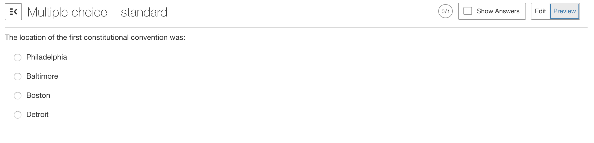
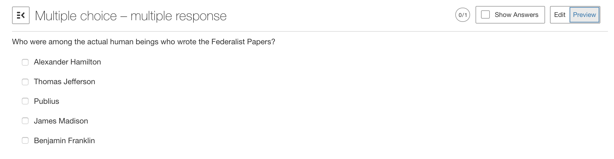
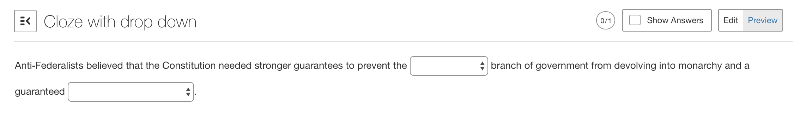
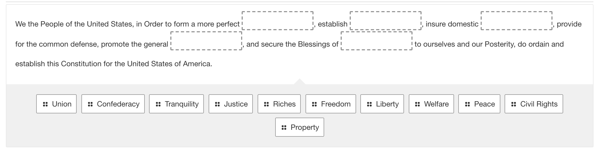

# Lumen Learning Code Review Assignment
## TypeScript

This assignment is to produce a written code review for a pull request.  PLEASE DO NOT add notes directly to the pull request - instead, the pull request should be in a simple text file with the following format:

{ line number }: Comment on line number, with reasoning on the praise or concern for a given line.
{ line number} - { line number }: Comment on a block of code.

We're looking at how you respond to code at both a technical level and a team level, so please record your thoughtful response on how to improve the code, what you believe is particularly praiseworthy in the code, and advice in general which you would offer the creator of his pull request as a team mate.  Please do not spend more than an hour at this.

## Context and Acceptance Criteria

A developer with fifteen years of experience including three at this company, **"A"**, has been working on an assessment system.  This particular code relates to how those assessments are graded.  For each question type allowed on an assessment, there are different requirements for how the grade is calculated.  Developer A has written code to generate grades for the following question types:

### MULTIPLE CHOICE

In this case, only one answer from a number of answers can be chosen.  If the correct answer is chosen, return 1.0; otherwise, return 0.0.

### MULTIPLE ANSWER

Here, multiple answers can be chosen from a range of answers.  The returned grade should be the number of correctly chosen answers divided by the number of correct answers total.  So if a user chooses 1 out of 2 correct answers, they will be given 0.5.  If they had chosen 2 out of 2 correct answers, they would have been given 1.0.  There is no penalty for incorrect answers.

### MULTIPLE DROP DOWN

Here, text is shown with drop down selections for certain words.  A user is able to select only one selection for each of the chosen words.  The grade would be the number of correctly chosen answers out of the total number of drop down selections.  If a question had four embedded drop down selections and a user selected all of them correctly, the total would be 1.0.  If they had selected only one drop down selection correctly, then the total would be 0.25.

Developer A's code has been thoroughly reviewed and is in production.

A developer with four years of experience, including a year at this company, **"B"**, has been tasked with adding a new question type:

### CLOZE DRAG AND DROP

In this question type, the question is presented as text with a number of blanks in it.  Below the question is a pool of words, typically exceeding in size the number of blanks in the question.

The grade will be the number of correctly placed words divided by the number of words to fill in.  Thus, if a user placed all the words correctly, that user would be given a 1.0.  If they had placed two out of five words correctly, they would be given a 0.4.  Words which belong in the sentence, just not at the position they were placed in, will be neither credited nor penalized.  The exception to this case is if the user placed all the words correctly, just not in the correct order - in that case, the user will be given a 0.5 (no matter how many words were correctly placed).

The pull request is intended to implement this logic.